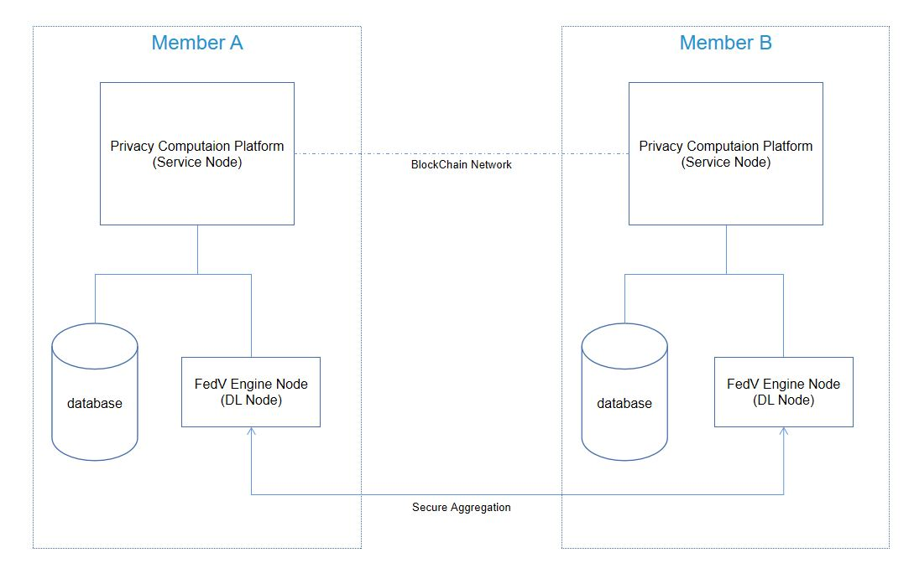
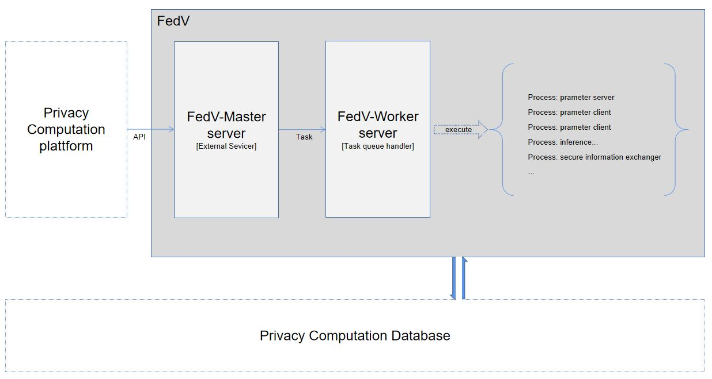
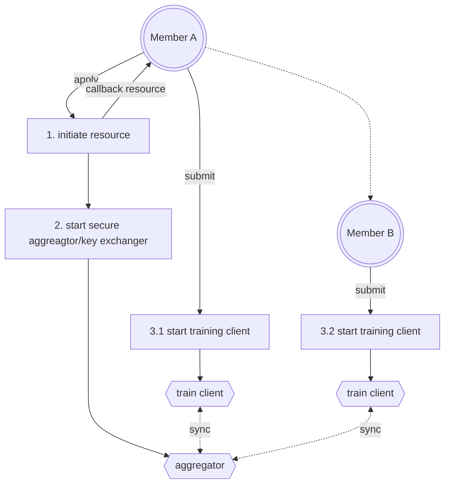

>This repo contains
>- A **Study of Swarm Learning Application in Medical Reseach**, which implements YOLOv8 Fracture Detection with Swarm Learning/Federated Learning
>- An **Up-to-date FL/SL Learning Engine Module**, which supports swarm learning/federated learning on Computer Vision Tasks.
___
#### About Swarm Learning Study

Article 
> [Swarm learning for secure decentralized artificial intelligence in orthopaedic image analysis]()

##### Background
- Computer vision technology are developing fast and AI-assisted medical diagnose are promising. Training a reliable model usually requires a large size of dataset. Collecting medical data can be diffcult and violate privacy.
- Swarm Learning allows multiple parties to collaborate in training model while keeping their data private.

This project proposed a swarm learning solution and verified the effectiveness of swarm-learning model compared with centralized model.
##### Scripts, Data and Results
please see [Experiment](./Experiment/)

___
#### About Engine Module 

##### Background/motivation of FedV
FedV is aimed to provide swarm learning / federated learning abilities with industry-level/cutting-edge cv models in a more flexiable FL framework.
This project is inspired by  [FedVision](https://github.com/FederatedAI/FedVision) and [Wefe](https://github.com/tianmiantech/WeFe)-VisualFL. The basic idea and a small part of code is inherited from these two projects. Although these two projects provide federated learning modules for cv tasks, they are both based on PaddleFL, which seems to be outdated and nolonger mantained. FedV(this project) uses modified parameter-server framework([Flower]((https://github.com/adap/flower))), targeting to intergrate with privacy computation platform for enhanced security measures, and support a batch of deep learning algorithms.
##### Architecture
FedV provides services to handle computer-vision swarm learning/federated learning tasks. It works as a plug in module for privacy computation platform. It can be deployed independently and bind with platform node. The privacy computation platform works as a manager and scheduler, which will manage participants, collect configurations, distribute dataset, and coordinate all participants then call FedV to initiate cv tasks for each participates. 

FedV Master servicer handles request and convert request to local task. then submit to task queue. worker servicer is the consumer, execute process to run the task. When Database enabled, it will verify, synchronize task status/progress to the database. The results/metrics are also writen to database.


##### Learning workflow
The core workflow follows the parameter-server architecture.
A process is as follows



Fedv also provides APIs to converage the whole lifecycle of trained models, such as validation workflow and inference workflow.

At current stage,
- The Privacy Compuating Platform is not open sourced. Please use [Wefe](https://github.com/tianmiantech/WeFe) platform as a reference of privacy compuation platform.
- Features/functions which works with Privacy Computation Platform, such as dynamic aggregator are not released now.


##### Quick start
Containered Build & Deploy
```bash
export DOCKER_BUILDKIT=1
docker build . -t {imagename} -f Deploy/Dockerfile_cpu # CPU Version
# docker build . -t {imagename} -f Deploy/Dockerfile_gpu # GPU Version
docker run -dit --restart=always -v {path to deploy_config.file}:/FedV/deploy_config.yml -v {path to db_config.file}:/FedV/config.properties --network=host --name FedV-Service {imagename}
```
Please refer to [deploy readme](./VisualFederated/Deploy/README.md)

Run Examples *TODO*

##### Supported Models
- Detection
    - YOLOv8 :heavy_check_mark:
    - YOLOv9 :construction:
- Classification
    - Resnet(18,34,50,101) :heavy_check_mark:

New models may be added if required.
Anyone can add models by yourself, please refer to [Flower](https://github.com/adap/flower)

##### API
Not released at current stage

### Reference Repo
This project is inspired by following great project:

- [Ultralytics](https://github.com/ultralytics/ultralytics)

- :cherry_blossom: [Flower](https://github.com/adap/flower)

- [Wefe](https://github.com/tianmiantech/WeFe)
