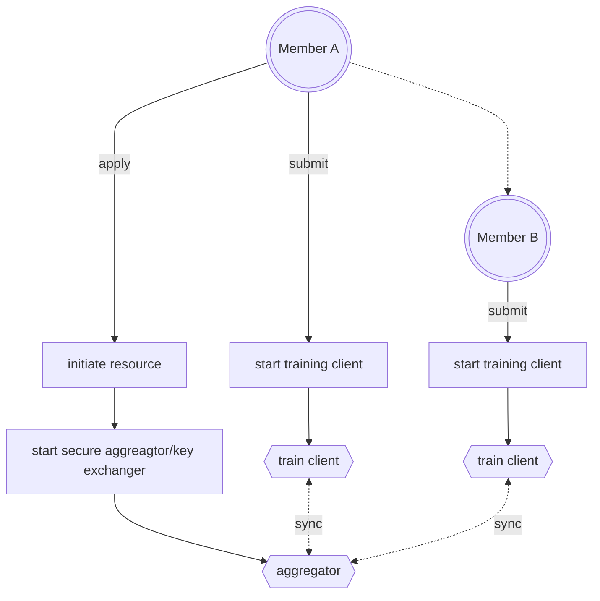

English | [简体中文](./README_ch.md)

### Overview
**FedV** A fedreated learning module for cv deep learning, which can be intergrated with a privacy computation platform.
##### background/motivation of FedV
FedV is aimed to provide federated learning abilities with industry-level/cutting-edge cv models in a more flexiable fl framework.
This project is inspired by  [FedVision](https://github.com/FederatedAI/FedVision) and [Wefe](https://github.com/tianmiantech/WeFe)-VisualFL. The basic idea and a small part of code is inherited from these two projects. Although these two projects provide federated learning modules for cv tasks, they are both based on PaddleFL, which seems to be outdated and nolonger mantained. FedV(this project) uses a simple parameter-server framework(Flower), which supports a batch of deep learning framework.

##### Architecture

FedV provides external services to handle computer vision tasks. It works as a plug in module for the privacy computation platform. It can be deployed independently and bind with one platform. The privacy computation platform will manage participants, collect configurations, generate dataset download url, and coordinates all participants then call API to initiate cv tasks for each participates. 
Master servicer handles request and convert request to local task. then submit to task queue. worker servicer is the consumer, execute process to run the task. When Database enabled, it will verify, synchronize task status/progress to the database. The results/metrics are writen to database.

The core function, federated lerning, follows the basic parameter-server architecture.
A process is as follows



Fedv also provides APIs to converage the whole lifecycle of trained models, such as validation and inference.

However, unfortunately,
- The Privacy Compuating Platform will not be open sourced. 
- Extra features/functions which works with Privacy Computation Platform, such as dynamic aggregator are not included in this project.

Please use [Wefe](https://github.com/tianmiantech/WeFe) platform as a reference.

### Quick start
##### Build & Deploy

```bash
export DOCKER_BUILDKIT=1
docker build . -f Deploy/Dockerfile_cpu
```
Please refer to [deploy readme](./Deploy/README.md)